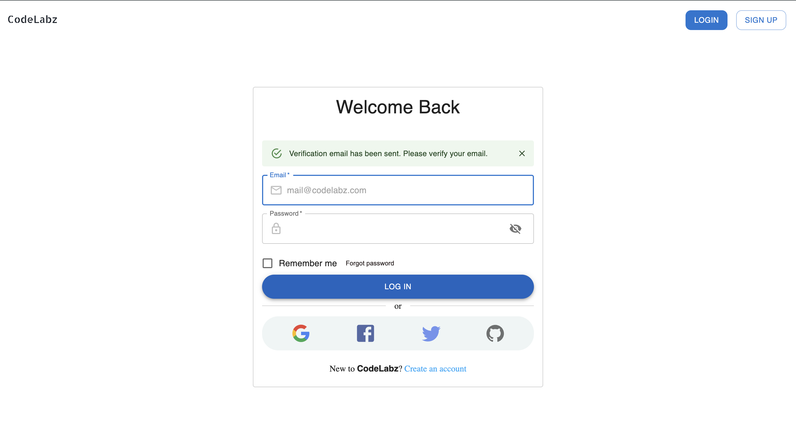
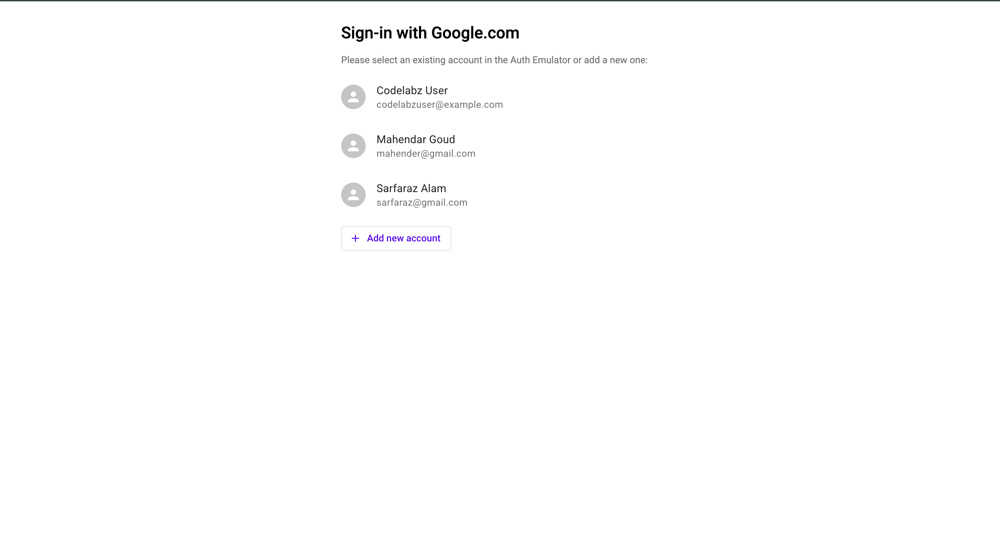
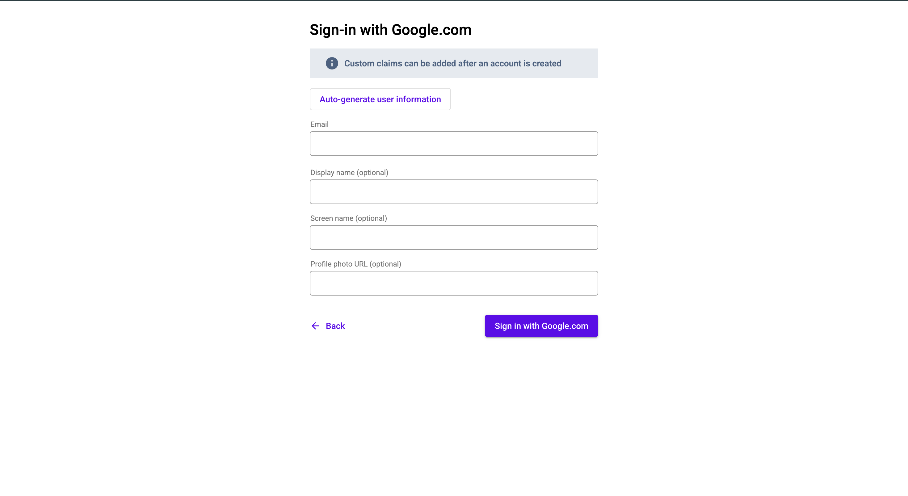
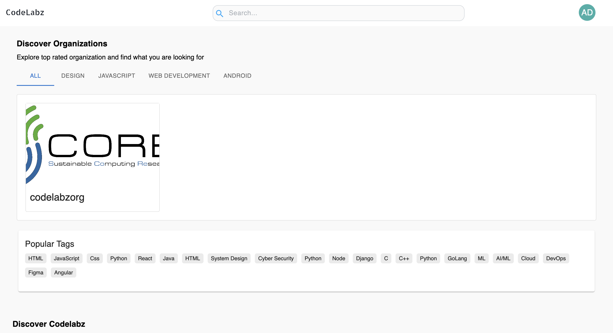

<h1 align="center">CodeLabz</h1>

<p align="center">
  <b>A platform for interactive online tutorials — built for organizations and learners alike.</b>
</p>

<p align="center">
  <a href="https://app.slack.com/client/T06C3R6HVNG/C06C1CL3S2W"></a>
  <a href="./LICENSE"></a>
  <a href="https://github.com/c2siorg/Codelabz"></a>
</p>

---

## 📑 Table of Contents

- [📖 Overview](#-overview)
- [🖥️ App Preview](#️-app-preview)
- [✨ Key Features](#-key-features)
- [🛠️ Tech Stack](#️-tech-stack)
- [📁 Project Structure](#-project-structure)
- [🚀 Quick Start](#-quick-start)
- [🤝 Contributing](#-contributing)
- [📜 License](#-license)
- [💬 Community & Support](#-community--support)

---

## 📖 Overview

**CodeLabz** is an open-source platform where **organizations can create and publish coding tutorials** and **users can engage with them interactively**. It provides a seamless environment for hands-on learning through step-by-step guided tutorials, a collaborative rich-text editor, and real-time organization management.

The project is developed and maintained under [c2siorg](https://github.com/c2siorg) and welcomes contributors from around the world.

---

## 🖥️ App Preview

Here's a quick walkthrough of the user experience:

### ⚠️ Email Verification (Known Issue)

<p align="center">
  
</p>

<p align="center"><i>If you register with an email, you'll be asked to verify it — but the email is never sent.</i></p>

> [!WARNING]
> **Heads up!** Email verification is **not yet implemented**. If you sign up using email and password, you'll see a prompt asking you to verify your email, but the verification link will never arrive. **Use the Google Sign-In method below instead.**

### 📝 Create an Account

<p align="center">
  
</p>

<p align="center"><i>The account creation screen — you can sign up with email, but Google is recommended for now.</i></p>

### ✅ Sign In with Google (Recommended)

<p align="center">
  
</p>

<p align="center"><i>The easiest way to get started — sign in with your Google account and you're in!</i></p>

### 🏠 Dashboard

<p align="center">
  
</p>

<p align="center"><i>Once logged in, explore organizations by category and discover tutorials through popular tags.</i></p>

---

## ✨ Key Features

- **Interactive Guided Tutorials** — Engaging step-by-step coding lessons for users.
- **Organization Management** — Tools for organizations to create, manage, and publish content.
- **Collaborative Editor** — A powerful rich-text editor for seamless tutorial creation.
- **Real-time Synchronization** — Powered by Firebase and Yjs for collaborative workflows.
- **Progress Tracking** — Users can track their engagement and learning journey.
- **Modern & Responsive UI** — A sleek, user-friendly interface built with React and Material UI.

---

## 🛠️ Tech Stack

| Category | Technologies |
|---|---|
| **Frontend** | React, Vite, Redux, Material UI (MUI), Ant Design Icons |
| **Backend** | Firebase (Firestore, Real-time DB, Cloud Functions) |
| **Collaboration** | Yjs, Quill (Rich Text Editor) |
| **Testing** | Cypress (E2E), Storybook (Component Dev) |
| **Tooling** | ESLint, Prettier, Husky |

---

## 📁 Project Structure

The codebase is organized into clear sections:

### 🎨 Frontend (`src/`)

This is where the main application lives.

| Folder / File | What it does |
|---|---|
| `components/` | All the UI components, organized by feature (e.g., Organization, Tutorial, Editor) |
| `store/` | Redux state management — actions, reducers, and global app state |
| `auth/` | Authentication logic — Google sign-in, email/password, etc. |
| `helpers/` | Utility functions and validation helpers |
| `globalComponents/` | Reusable UI building blocks (Buttons, Inputs, Cards) |
| `assets/` | Images, SVGs, and static resources |
| `css/` | Global styles and component-level LESS/CSS |
| `stories/` | Storybook stories for component development |
| `config/` | App-level configuration files |
| `App.jsx` | Root component — wraps the entire app |
| `routes.jsx` | All route definitions and page navigation |
| `main.jsx` | Entry point — bootstraps the React app |

### ⚙️ Backend (`functions/`)

Firebase Cloud Functions that handle server-side logic.

### 🧪 Testing & Quality

| Folder / File | What it does |
|---|---|
| `cypress/` | End-to-end (E2E) test suite |
| `testdata/` | Sample data used by Firebase emulators for local testing |
| `.storybook/` | Storybook configuration for visual component testing |
| `.husky/` | Git hooks — auto-runs linters before each commit |

### 🔧 Configuration (Root Files)

| File | What it does |
|---|---|
| `.env.sample` | Template for environment variables — copy this to `.env` |
| `firebase.json` | Firebase emulator and service configuration |
| `vite.config.js` | Vite bundler settings (dev server, build, etc.) |
| `Makefile` | Shortcut commands for common dev tasks |
| `package.json` | Dependencies, scripts, and project metadata |

### 📂 Other Folders

| Folder | What it does |
|---|---|
| `.github/` | CI/CD workflows, issue templates, and PR templates |
| `designs/` | UI/UX design specs and mockups |
| `public/` | Static files served directly (favicon, `index.html`) |
| `docs/` | Documentation and screenshots |

---

## 🚀 Quick Start

Get the project up and running on your local machine in just a few steps:

1. **Clone the repository**:
   ```bash
   git clone https://github.com/c2siorg/Codelabz.git
   cd Codelabz
   ```

2. **Install dependencies**:
   ```bash
   npm install
   ```

3. **Set up Environment Variables**:
   Create a `.env` file based on `.env.sample` and add your Firebase configuration.

4. **Run the development server**:
   ```bash
   npm run dev
   ```

> [!TIP]
> For a detailed, step-by-step guide on setting up Firebase, local emulators, and troubleshooting, please refer to our **[INSTALLATION.md](./INSTALLATION.md)**.

---

## 🤝 Contributing

Contributions make the open-source community an amazing place to learn, inspire, and create. Any contributions you make are **greatly appreciated**.

1. Please read our **[CONTRIBUTING.md](./CONTRIBUTING.md)** for details on our code of conduct and the process for submitting pull requests.
2. Adhere to our **[CODE_OF_CONDUCT.md](./CODE_OF_CONDUCT.md)** to ensure a welcoming environment for all.

---

## 📜 License

Distributed under the **Apache 2.0 License**. See **[LICENSE](./LICENSE)** for more information.

---

## 💬 Community & Support

```markdown
- **Slack**: [Join our Slack workspace](https://app.slack.com/client/T06C3R6HVNG/C06C1CL3S2W) to ask any doubts or share suggestions.
```
- **Issues**: Report bugs or request features via the [GitHub Issues](https://github.com/c2siorg/Codelabz/issues) page.

---

<p align="center">Built with ❤️ by <b>c2siorg</b></p>
